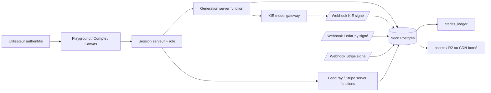

# Cortexia — Root System

**Date :** 25 août 2026  
**Structural path :** `product > unified account > generation/payment trunk`  
**Phase :** Root System  
**Statut :** `ready_for_trunk`

## Architecture cible du premier ring

Cortexia conserve le déploiement web/server actuel comme point de départ. Le navigateur ne parle jamais directement aux secrets fournisseur. Il appelle des fonctions serveur authentifiées ; celles-ci lisent le modèle actif et le prix depuis la base, réservent ou créditent le ledger, appellent le fournisseur, puis persistent l’état de l’opération. Les callbacks bruts des fournisseurs vérifient leur signature avant de déléguer à un processeur idempotent.

## Sources de vérité

| Préoccupation      | Source autoritative                              | Règle                                                                          |
| ------------------ | ------------------------------------------------ | ------------------------------------------------------------------------------ |
| Identité           | Session Neon Auth + `users`                      | L’ID utilisateur côté serveur est la seule identité de propriété               |
| Modèle et capacité | `models` en base, seedée depuis `models-data.ts` | Une entrée doit être active, configurée et réconciliée avant exécution         |
| Prix               | `cortexia_price_usd` + unité de facturation      | Le client peut afficher un prix, mais le serveur le recalcule                  |
| Solde              | `credits_ledger` et helper de crédit             | Aucun changement direct de `users.credits_balance`                             |
| Paiement           | `payment_transactions`                           | Chaque commande externe porte une `external_reference` unique                  |
| Exécution          | `runs` + `run_node_executions`                   | Les états provider sont mappés vers des états internes bornés                  |
| Résultat           | `assets` et `text_result`                        | L’asset appartient à l’exécution et à l’utilisateur selon la politique d’accès |
| Agent              | `agent-models.ts` + catalogue fidèle             | L’agent ne voit ni ne propose les alias non vérifiés                           |

## Contrats serveur

### Génération

Entrée logique : `modelSlug`, `input`, et éventuellement `workflowId`. Le serveur authentifie l’utilisateur, vérifie le modèle actif et son endpoint, résout les uploads, normalise les messages texte, calcule le coût depuis le modèle de base, vérifie le solde, vérifie la propriété du workflow, persiste un run en état de soumission, réserve le coût avec une référence stable, puis appelle le fournisseur. Les modèles texte retournent un résultat synchrone ; les modèles média retournent un `taskId` et passent par callback/polling.

Une erreur avant soumission ne doit pas laisser un débit définitif. Une erreur après soumission doit conserver le `taskId`, l’état d’incertitude et le chemin de réconciliation ; elle ne doit pas être transformée en succès par le client.

### Paiement

Entrée logique : montant borné, méthode et clé d’idempotence. Le serveur crée une transaction `pending` avec une référence externe unique. Pour FedaPay, la vérification doit rapprocher utilisateur, transaction, statut accepté, montant, devise et référence marchand avant d’inscrire `payment:<payment_transaction_id>` dans le ledger. Pour Stripe, la signature doit être vérifiée sur le corps brut et le même événement ne doit créditer qu’une fois.

### Agent

Entrée logique : message, modèle agentique vérifié, état courant du graphe et workflow appartenant à l’utilisateur. Le serveur résout le modèle agent dans le catalogue fidèle, envoie l’identifiant fournisseur configuré, parse un plan borné, filtre toute opération dont le modèle n’est pas dans le catalogue fidèle et exige une confirmation selon le coût ou le mode de permission. L’application du plan reste une opération serveur distincte de la simple proposition.

## États et transitions critiques

| Objet      | États principaux                                         | Transitions autorisées                                                         | Récupération                                                    |
| ---------- | -------------------------------------------------------- | ------------------------------------------------------------------------------ | --------------------------------------------------------------- |
| Paiement   | `pending`, `completed`, `failed`, `needs_review`         | `pending → completed` seulement après vérification ; mismatch → `needs_review` | Réconciliation opérateur ; jamais d’édition directe du solde    |
| Exécution  | `submitting`, `queued`, `running`, `succeeded`, `failed` | Le callback ne peut viser que le `taskId` connu et la ligne non terminale      | Retry fournisseur ou revue ; remboursement si aucune soumission |
| Asset      | créé après résultat vérifié                              | Attaché à une exécution connue                                                 | Fallback CDN explicitement marqué tant que R2 n’est pas actif   |
| Plan agent | proposé, confirmé, appliqué, annulé                      | Application après permission et propriété du workflow                          | Rejouer un plan validé ; ne pas réappliquer aveuglément         |

## Permissions et frontières de confiance

Le client peut demander une génération, afficher un coût et proposer un plan, mais ne peut pas décider du prix, du propriétaire, du statut de paiement, du montant du crédit, de l’endpoint fournisseur ou de la transition finale. Les callbacks sont des entrées externes non fiables jusqu’à vérification cryptographique et rapprochement DB. Les prompts et contenus utilisateur ne doivent pas apparaître dans les logs opérationnels en clair lorsque cela n’est pas nécessaire.

## Décisions d’architecture différées

Le premier ring ne requiert pas de worker séparé : les callbacks actuels sont bornés et idempotents. Si le volume, la durée de traitement ou les retries rendent le travail inline trop lourd, ouvrir une décision Root System pour une file durable. Les intégrations pays supplémentaires, le multi-devise natif et le routage multi-provider doivent également faire l’objet de décisions séparées, avec coûts et réconciliation propres.

## Définition de fini du Root System

Le Root System est suffisamment défini pour le trunk lorsque les tables existantes, les contrats serveur, les frontières de confiance, les références d’idempotence, les états d’erreur et le runbook concordent ; lorsqu’aucun secret n’est requis côté client ; lorsqu’un modèle, un paiement et une exécution peuvent être rapprochés par identifiants stables ; et lorsque tout fallback manuel ou CDN est déclaré comme tel.

## Références

[1]: ../../drizzle/schema.ts "Cortexia persistent schema"
[2]: ../../src/lib/api/generate.ts "Cortexia generation server function"
[3]: ../../src/lib/api/payments.ts "Cortexia payment server functions"
[4]: ../../server/api/webhooks/kie.ts "Cortexia signed KIE webhook"
[5]: ../../server/api/webhooks/stripe.ts "Cortexia signed Stripe webhook"
[6]: ../../src/lib/agent-models.ts "Cortexia verified agent registry"
[7]: ../../PRODUCTION-RUNBOOK.md "Cortexia production runbook"
